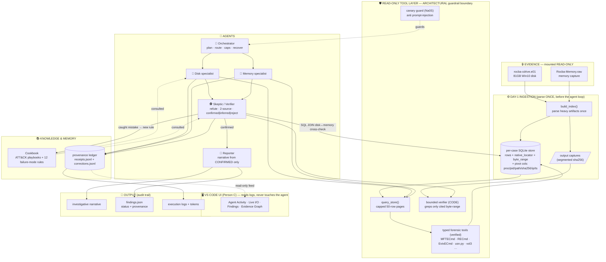

# 11 — THE 8-DAY ROADMAP (Mon Jun 8 → Mon Jun 15)

> Built + verified by workflow (extract → merge → completeness critic → feasibility critic → day-plan). Companion to [10-ARCHITECTURE-GRAPH.md]. Created 2026-06-08.
> Category tags: 🔬research · 🕵️investigate · 🔨build · 👁️monitor · 🧪test · 📝docs · ⚙️setup · 🎤present · 🖥️ **VS code UI**

---

## 🎯 THE LENS — every task builds the AI forensic *investigator*, not a Rocba *answer*
> The deliverable is a **reusable autonomous AI forensic investigator + a Cookbook that teaches it how to behave.** **Rocba (the 81 GB case) is only the TEST case — never the product.** Apply this to every task below.

**Litmus test (ask it of any task):** *"If I delete Rocba and drop in a brand-new case tomorrow, what survives — a capability that still runs, or just an answer I can't reuse?"*
- **🛠️ A — Tool-building:** leaves a reusable capability or Cookbook rule that runs on *any* case. ✅ this is what's judged (rules: *"any case data," "fully autonomous," "another practitioner can deploy and build on this"*).
- **🚫 B — Case-solving (one-time):** only answers Rocba, or **hardcodes Rocba facts/paths/thresholds** into the system. ❌ fix it — make the *mechanism* general; keep Rocba as a tested-on default.
- **📸 C — Demo/submission output:** legitimately one-time (the 8 components: video, Devpost, dataset doc, accuracy report, benchmark *run*, install test, submit). ✅ it *proves* the tool — fine.

**Audit (11-agent rules-grounded pass):** ~94% tool-building. The submission deliverables are the C tasks (legitimate). Only **3 tasks were misframed** (each hardcoded a Rocba-specific choice) — now reframed inline below (look for ✏️): all fixed by making the agent **discover/decide at runtime via the Cookbook**, not bake the answer in.

---

## 🏗️ ARCHITECTURE — what we are building (the project at a glance)
*The chart the whole roadmap builds toward. Agent-hierarchy + step-by-step sequence views are in [10-ARCHITECTURE-GRAPH.md].*

**Guardrail legend (judges require this):** 🛡️ **architectural** (code-enforced, can't be prompted away) = read-only mount · `query_store` caps · bounded verifier · SQL-JOIN corroboration · canary. 📝 **prompt-based** = Cookbook rules · confirmed/inferred labels · Identification-only scope.

---

## ⚠️ READ FIRST — 7 things that decide whether this works

1. **Team size = 3.** ~185h **core** over 8 days. The **VS Code UI (~20h) is a BONUS on top** — do it only after each day's core is done.
2. **🖥️ VS Code UI is added INTO each day as a bonus block** (`↳ 🖥️ VS code UI`) — local web dashboard in `sift-ui/` that just *reads* the agent's logs (**not a fork**), front-loaded to Days 1–4 so it's debugging the agent by Day 4. If a day's core slips, skip that day's UI.
3. **🚨 Stage-1 gate: install & EXTEND *Protocol SIFT* specifically** — not just the SIFT Workstation. A generic agent risks pass/fail elimination. (Day 1.)
4. **One "spine owner" owns the critical path** (ledger→index→verifier→agents→demo) Days 1–7, never blocked — extra people can't shorten this serial chain.
5. **Kick the 81 GB index off overnight (Day 1 night).** Plaso over 81 GB is hours of machine time. The flat-baseline fallback (Day 2) emits a real finding before the index finishes.
6. **"Fine-tuning" = tuning verifier weights/prompts, NOT model fine-tuning** (model stays frozen). Document it as a deliberate choice.
7. **Beat TWO baselines:** Protocol SIFT's own output (the brief's success metric) AND the prior Claude run (07-BASELINE).

## 📊 DAILY CORE LOAD — the non-negotiable to stay on deadline
> Hit the **core** each day = you're on track. UI is extra, only if core is done.

| Day | Date | Core (team) | ≈ per person (÷3) | + UI bonus |
|----|------|:---:|:---:|:---:|
| 1 | Mon Jun 8 | ~26h | ~8.5h | +4h |
| 2 | Tue Jun 9 | ~30h | ~10h | +4h |
| 3 | Wed Jun 10 | ~30h | ~10h | +4h |
| 4 | Thu Jun 11 | ~32h | ~10.5h | +4h |
| 5 | Fri Jun 12 | ~30h | ~10h | +2h |
| 6 | Sat Jun 13 | ~31h | ~10.5h | +3h |
| 7 | Sun Jun 14 | **~4h** | ~1.5h | — |
| 8 | Mon Jun 15 | **~3h** | ~1h | — |

> **Rebalanced 2026-06-09 (Mehrnoosh):** Days 2–6 deliberately run HOT (~10h/person) so Days 7–8 are presentation-only (≤4h). Docs are drafted the day their content exists (rolling README D3+, diagram D4, drafts D5, finalize D6); video raw takes D6, edit-only D7. If a hot day slips, cut that day's UI bonus FIRST, then pull from the stretch list — do NOT push work back onto D7/D8.

**Rule of thumb:** if you've cleared a day's core checkboxes and hit its ⏰ deadline gate, you're safe — *then* pick up that day's `↳ 🖥️ VS code UI` task.

---

## DAY 1 — Mon Jun 8 · Foundations + Data Spine + launch index  ·  core ~26h (+ UI ~4h)
🎯 **Ship today (core):** repo live + Protocol SIFT running + ledger/Finding/mount work + 81 GB index launched overnight.
- [x] ⚙️ Public repo **[find-evil-hackathon](https://github.com/M-Abrisham/find-evil-hackathon)** + MIT LICENSE + `.gitignore` ✅ · dated first commit auto-created by the GitHub web edits (verify: repo → *Commits* = Jun 8 2026). Next: `git clone` on the SIFT box. *(confirm `.gitignore` blocks `.E01`/`.raw`/keys/PII)*
- [x] 🔨 **Protocol SIFT installed + baseline captured** ✅ — it's a Claude Code config (`~/.claude/`: CLAUDE.md + 5 SKILL.md, **`Bash(*)` only**), git HEAD `40bed7a`. Baseline → [13 - Protocol SIFT - Baseline Run Report](<13 - Protocol SIFT - Baseline Run Report.md>)
- [x] 🕵️ Reconcile receipt fields vs `tools.jsonl` ✅ — existing log = 8 fields, **no hash/uuid (not tamper-evident today)**; of our 11: `ts`✓, `tool`/`args` partial (from `command`), 8 missing. Plan → `docs/ledger-reconcile.md` (extend `log_entry()`, add SHA-256 chain, back-fill on a copy). **Feeds the ledger task ↓**
- [x] 🔨 Na0S `cost_tracker`+`audit`+`rate_limiter` imported (pinned @ `a8751167`, wrapped not vendored) + `telemetry.py` wired — token+UTC-ts on LLM **and** tool rows ✅ (commit `1a351cc`, not yet pushed). ⚠️ follow-ups ↓: cost→fixed-decimal string (canonical); make fleet-wide/concurrency-safe + wire `$8` cap; doc env prereqs
- [x] 🔨 Finding dataclass — committed `b606965` (validate() + canonical (de)serialization) ✅ *(code not yet reviewed in-chat — paste it if you want a check)*
- [x] 🔨 Hash-chained provenance ledger (`receipts.jsonl`) + `verify_chain()` ✅ committed `1588ac4` *(verified on VM; code not yet reviewed in-chat)*
- [x] 🔨 Read-only mount + intake ✅ — ewfmount→ntfs-3g `-o ro` (write FAILS even as root), before==after==baseline SHA-256, sidecar `evidence-baseline.json`; MCP scaffold (branch `feat/evidence-intake-mcp`, commit `ea8db44`) — **no-shell guarantee proven 3 ways incl. a non-vacuous AST scan**, 92 tests pass
- [x] 🔨 Build `build_index()` enough to launch → **kick off the 81 GB super-timeline index overnight** ✅ `0d1fa2c` — real run 01:22–01:51 Jun 9 produced `rocba.plaso` (1.1 GB) + `rocba_timeline.jsonl` (3.5 GB) + `rocba_index.sqlite` (1.3 GB); parse-once/streamed/timestomp-safe, ledger receipts, tests green. ⚠️ built its OWN schema (branched pre-`store.py`) → **reconcile with `store.py` before merge** (see backlog 🔴)
⏰ **Deadline gate (core):** repo+license live; Protocol SIFT runs; ledger+Finding+mount work & verify_chain passes; index launched.
↳ 🖥️ **VS code UI** *(bonus — only if today's core is done):*
- [ ] 🖥️ VS code UI — agree the log/data contract with the spine owner (exact fields in receipts/a2a/corrections/findings)
- [ ] 🖥️ VS code UI — scaffold `sift-ui/` web app + live log poller against **mock sample logs**

## DAY 2 — Tue Jun 9 · Read-only MCP guardrail + tools + query path  ·  core ~30h (+ UI ~4h)
🎯 **Ship today (core):** the architectural guardrail (no shell) + capped query_store + disk tools + first real receipted finding.
- [x] 🔨 Finish the **slim read-only Custom MCP server** — typed functions, **NO `execute_shell`** *(guardrail owner)*; **route every tool through ONE vetted read-only runner** (whitelisted binary · no `shell=True` · typed args) so `vol`/`fls`/`MFTECmd` wrappers run without breaking the guardrail → **update the AST test from "no subprocess" to "subprocess only via the runner"** + add a non-vacuous scanner self-test ✅ — `runner.py` is the single subprocess chokepoint (commit `cec5e9f`); guard evolved to *"subprocess only via runner.py"* + non-vacuous planted-violation self-test (`tests/fixtures/planted_subprocess_violation.py`); `shell=False` + typed args + hash-chained receipts + capped returns; **132 tests pass**. Built + committed on `feat/evidence-intake-mcp` (local, **not yet pushed**). *(optional last-5%: one real tool e2e through the runner — unit tests currently fake the subprocess.)*
- [~] ⚙️ Pin Na0S as MIT dependency (wrap, don't vendor) + start the novel-vs-reused contribution table **with a license/ToS column** (covers HHEM-2.1, Atomic Red Team, any threat-intel source — Rules L57/L101 third-party authorization) — *reuse audit ✅ (8-agent, code-grounded): reused modules are complete + tested; Na0S's incompleteness is only in its core ML scanner we don't touch. Decision: **PIN, not vendor** (the numpy-import wall is off-box only; Day-1 already pinned the logging trio). Still TODO: install-footprint check + the contribution table — corrected prompt ready.*
- [ ] 🔨 ✏️ **Tool-capability probe (general)** — at case start the agent auto-resolves which forensic tools exist on the box (path+version, via the runner's `inventory()`) and emits a per-case capability report, so it routes by *capability*, not hardcoded names. *(on this box: Vol3=`vol`, RECmd path, PECmd absent)* + document both evidence types w/ MD5/SHA1
- [ ] 🔨 ✏️ **Evidence-source fallback chains (Cookbook-driven)** — for each evidence type the Cookbook defines a priority-ordered tool list; the agent auto-picks the highest-*available* at runtime and tags weaker sources inference-only. *(on this box: execution → Security-4688/EvtxECmd + RECmd UserAssist/BAM/DAM since PECmd absent; Amcache/Shimcache = inference-only)*
- [x] 🔬 **OS-Coverage Matrix — run-verified, all-OS** ✅ *(added; feeds the two ✏️ items above)* — box-level capability map across **Windows/Linux/macOS/Cloud/Network/Media/Email** (71 artifacts → verified tool · status · coverage · recipe-needed) + machine-readable **`os-coverage.yaml`** (the OS-detector's routing table) + generator with a round-trip self-check. Independently re-verified locally (71/71); caught **14 false tool-claims** (mac_apt broken, auditd unparseable, Entra/M365 absent…). *(minor fix-up queued: 2 garbled tool rows + Windows-RAM symbol-reachability check.)*
- [~] 🕵️ Resolve **SRUM ESE gap** (`libesedb`/`esedbexport` on `SRUDB.dat` → SRUM index path) — *partial:* `esedbexport 20240202` + plaso `srum` parser **run-verified present** (OS-matrix P3); still TODO: the actual `SruDbIdMapTable` join recipe + worked example (deep-dive prompt ready to run)
- [x] 🔨 SQLite store schema (NON-NULL `native_locator` + `byte_range` + 6 pivot cols) + segmented chunk-hash tree ✅ — `store.py` built + tested (branch `feat/query-store`, suite green; not yet merged)
- [x] 🔨 Capped **`query_store()`** (limit≤50, truncated+total_count+cursor+locator+byte_range) — only model read path; window=WHERE ✅ — built + tested on `feat/query-store` (not yet merged)
- [ ] 🔨 Typed read-only **DISK wrappers** (MFTECmd, EvtxECmd, RECmd, usn.py/$J, LECmd/JLECmd, SBECmd, RBCmd, SQLECmd) — handle **single-volume E01: no partition table, so run at offset 0 (`mmls` fails — expected)**
- [ ] 🔨 Flat-baseline fallback → emit one real Finding **today** + `extract_literals()` regex
- [ ] ⚙️ **Join the Protocol SIFT Slack** → pull the **starter evidence datasets + example submission + practice MCP endpoint** (Rules L45) — this is the judge-runnable evidence path the Day-7 Try-It-Out needs ("run locally *against provided evidence*"), and the example submission is the only sponsor-provided calibration of judge expectations *(small, ~1h)*
- [ ] ⚙️ **Give Claude access to the Slack** (Slack MCP server / claude.ai Slack connector) so Claude can read the Protocol SIFT channels + messages and **extract/download the evidence cases & starter resources for me** — keep the integration **READ-ONLY** (no posting); downloaded evidence goes through the SAME intake as Rocba (read-only mount + SHA-256 baseline sidecar)
- [ ] ⚙️ **Devpost admin** *(~30 min)*: name the **Representative** + confirm all 3 members clicked "Join Hackathon"; quick eligibility sanity check (age of majority · no prohibited/OFAC country · no SANS/judge affiliation or conflict)
- [ ] 🧪 **Practice-MCP-endpoint smoke test** *(~1h)* — point the agent at the sponsor's practice MCP endpoint (pulled from Slack above) for ONE run → depth-safe proof of "remote endpoints via MCP" (Rules L49) without building a networking fleet
⏰ **Deadline gate (core):** MCP has no shell verb; query_store returns capped rows w/ byte_range; disk wrappers return receipted rows; one real Finding emitted.
↳ 🖥️ **VS code UI** *(bonus — only if today's core is done):*
- [ ] 🖥️ VS code UI — **Agent Activity Log pane** (left) + **Live Agent I/O pane** (bottom), wired to early logs

## DAY 3 — Wed Jun 10 · Verifier + Orchestrator loop + memory tools + decision log  ·  core ~30h (+ UI ~4h)
🎯 **Ship today (core):** bounded verifier + scorer + orchestrator loop w/ caps + memory wrappers.
- [ ] 🔨 **Bounded verifier** `check_receipt_match()` — grep only cited byte_range, check chunk-hash, assert literals verbatim (hard gate)
- [ ] 🔨 `check_consistency()` as SQL (event-after-acquisition, deleted-but-present, timezone-clash) + internal value-diff block
- [ ] 🔨 SQL-JOIN corroboration w/ **COUNT(*) parity** before "cross"
- [ ] 🔨 ✏️ **Tunable weighted scorer** — weights + thresholds live in an inspectable **config** (not hardcoded in logic), so they re-tune per threat-model/evidence without code changes + `emit_self_correction_event()` → `corrections.jsonl`. *(Rocba-calibrated defaults: 0.40/0.15/0.20/0.25/−0.50; T_high .85, T_low .50)*
- [ ] 🔨 **Orchestrator loop**: phase state machine, plan→dispatch→verify→checkpoint, **hard caps** (iter18/calls60/1800s/$8), fingerprint loop-detect, rollback→reflect→replan
- [ ] 🔨 **Live monitor → orchestrator feedback** (lightweight, code): tail `receipts.jsonl` and stream **grounded** signals (stuck-loop fingerprint · literal≠receipt · disk↔mem contradiction · tool exit≠0) to the orchestrator for real-time re-task/rollback; **recurring issue class → capture the failed trace as a plain-code scorer** (runs in CI on a golden image + live) → new Cookbook rule (self-improvement). Logs to `a2a.jsonl` + `corrections.jsonl` — **spec: every `a2a.jsonl` row carries a required UTC `…Z` timestamp** (elimination-gated component #8: multi-agent = a2a message logs WITH timestamps).
- [ ] 🔨 Typed read-only **MEMORY wrappers** (Vol3 pslist/psscan/pstree, cmdline, malfind, netscan, handles, printkey, dumpfiles) — structured only, raw/strings ban
- [ ] 🔨 Complete `build_index` ingest ($MFT, $J, EVTX, browser, SRUM); load Amcache + logon subset whole
- [ ] 🔨 **Per-step decision log `decisions.jsonl`** *(~2h)* — every orchestrator/specialist step emits {tool chosen · why · what we expected · what we actually found}; the four fields already exist in receipts + hypothesis/falsifier — just surface them as one trace → feeds the narrative, the UI Findings pane, and the video narration (Starter Idea #4 transparency; also richer failure traces for the playbook-tuning loop)
- [ ] 📝 **README skeleton (rolling, ~1h/day from today)** — start setup+deps sections NOW while installs are fresh; each module owner appends their section the day they build it — **kills the old Day-7 doc mountain**
⏰ **Deadline gate (core):** verifier+consistency+scorer are the hard gate; orchestrator runs w/ caps+loop detection; memory wrappers return structured output; decisions.jsonl emitting.
↳ 🖥️ **VS code UI** *(bonus — only if today's core is done):*
- [ ] 🖥️ VS code UI — **Findings pane** (right): status (confirmed/inferred/rejected) + provenance + **self-correction highlight** (the debugger)

## DAY 4 — Thu Jun 11 · Specialists + scope/identity gates + Cookbook-writer + arch diagram  ·  core ~32h (+ UI ~4h)
🎯 **Ship today (core):** both specialists emitting findings + the discipline gates that kill the prior run's hallucinations.
- [ ] 🔨 **Disk specialist** (hypothesis+falsifier → minimal calls → Findings w/ provenance; insufficient when absent)
- [ ] 🔨 **Memory specialist** (psscan-not-pslist, malfind RWX, parent mismatch → Findings)
- [ ] 🔨 Tool-failure handling: auto-retry alternate tool; **failed parse = blocker** (fixes F4)
- [ ] 🔨 **Scope-first phase**: inventory ALL evidence + enumerate lateral-movement dests (4648/4624/4688); **CODE gate: no scope claim without a COUNT receipt** (fixes F6) · ✏️ **+ decide the APPROACH up front** — form attacker-type × attack-type hypotheses (insider / external-APT / commodity / 3rd-party × exfil/ransomware/persistence/lateral/cred/multi-stage) via ACH → drives which playbooks + modalities get covered. **🔴 fixes the prior miss: "never decided who the exfiltrator could be."**
- [ ] 🔨 ✏️ **Evidence-completeness gate (pre-COMPLETE, CODE)** — cannot close while ANY present modality is unprocessed or ANY discovered IOC is un-pivoted. Per-modality musts: **RAM → full Vol3 plugin suite** (baseline ran only 7) · **images → `exiftool` geo+UTC + a steg/entropy check** (`ent`/`densityscout`/`outguess` + hash; `steghide`/`zsteg` absent on box → document the gap) · **cloud-client artifacts + creds** (consumer cloud on-disk/in-mem; enterprise = Future Work) · **log sets**. Plus mandatory **IOC-enrichment + correlation/timeline**; every IP/domain/hash/email/**phone** must be pivoted before close. **🔴 fixes the prior misses: cloud, RAM, photo geo/UTC/steg, the un-chased phone & 2 IPs** (fixes F10/F11) · **✅ acceptance check: the gate must be satisfiable WITHIN the Day-3 hard caps (iter18/calls60/1800s/$8) on Rocba** — batch the Vol3 plugin calls / bound the per-IOC pivot budget, or raise the caps; settle this on Day 4–5, **BEFORE the Day-7 video freeze** (Day 8's cap-hit observation is too late to fix anything)
- [ ] 🔨 **Identity-resolution gate**: no malicious label without hash+signature+path+known-tool + "is this ours?" (fixes F1)
- [~] 🔨 **Entailment/over-reach scorer = Vectara HHEM-2.1** ✅ **committed `fbaed26` (done early, verified on VM)** — LLM-judge fallback. STILL TODO on this line: refutation cap ≤2k; a2a bus + log; playbook loader + **PB-EXEC-001 & PB-MEMDISK-001**
- [ ] 🕵️ Read Protocol SIFT's **5 `SKILL.md` playbooks**; build our Cookbook as their **documented upgrade** (this is *how we extend Protocol SIFT* → Stage-1 + novel contribution) · *(could)* enrich `expect`/`falsify` with **Atomic Red Team** technique→artifact mappings (catches wrong attribution)
- [ ] 🔨 **Cookbook-writer agent (self-improvement write-back)** *(~3h)* — Skeptic catch → agent drafts a **versioned Cookbook rule diff** → applied with NO human edit (Rules L51 "without human intervention"); keep every cookbook/playbook version = component-#8 iteration-over-iteration traces. **PROMOTED FROM STRETCH — this is the learning story (Starter Idea #7) and the convergence curve's substance.**
- [ ] 📝 **Architecture diagram v1** *(~2h)* — architecture is locked today: name patterns **#1 Claude Code extension + #2 custom MCP + #3 multi-agent**, mark architectural vs prompt boundaries; Day 7 = polish only
⏰ **Deadline gate (core):** specialists emit provenanced Findings; scope/enrich/timeline/identity gates enforced; Cookbook-writer produces a versioned rule from a real Skeptic catch.
↳ 🖥️ **VS code UI** *(bonus — only if today's core is done):* **after this, the UI helps you fine-tune.**
- [ ] 🖥️ VS code UI — **Evidence Graph pane** (center) + **status-bar metrics** (FP rate, traceability %); **WIRE TO REAL LOGS → UI now usable for debugging**

## DAY 5 — Fri Jun 12 · Skeptic + self-correction + Reporter + FIRST FULL RUN + tuning + doc drafts  ·  core ~30h (+ UI ~2h)
🎯 **Ship today (core):** agent self-corrects with no human + one clean end-to-end run + rough demo recorded.
- [ ] 🔨 **Skeptic + self-correction gate**: ladder (receipt→CoVe→entail→disk↔mem cross→refute) **auto-reopens & revises WITHOUT a user follow-up** + benign ACH hypothesis
- [ ] 🔨 **Reporter**: structured narrative from confirmed Findings only + audit appendix + iter-1-vs-final delta + **partial-close semantics: on cap-hit the Reporter STILL emits the narrative with documented gaps** (keeps the mandatory structured-narrative rule satisfied on a cap-terminated run; the documented gaps feed the Accuracy Report's "honesty scores")
- [ ] 🔨 Claude Code as the loop + confirm **OpenClaw compatibility**
- [ ] 🧪 Scripted **repeatable end-to-end run, ZERO human intervention** (proves autonomy)
- [ ] 🧪 Run **Protocol SIFT on the case** → capture its baseline (head-to-head success metric)
- [ ] 🧪 **TUNING**: tune scorer weights/thresholds + prompts vs calibration key; write the "frozen-model / no fine-tuning" decision note — **+ explicitly reject GEPA/auto-prompt-evolution & stacked resample-scorers** (keep prompts inspectable; no hidden self-judging oracle)
- [ ] 🎤 Record a **ROUGH dry-run demo** as insurance + create the **Devpost shell** + save first draft — **structure the draft under the 5 required story headings** (What it does · How we built it · Challenges · What we learned · What's next) **+ tradeoffs + which autonomous-execution qualities** (the 3+1 list from the coverage proof), so Day 7 is polish, not restructuring
- [ ] 📝 **Doc-drafts block** *(~3h, split across team — MOVED from Day 7)*: **Devpost description full draft** (SIFT-hallucination thesis + 3-part fix + novel contribution + frozen-model decision, into the 5-heading shell) · **Try-It-Out draft** (judge evidence path: Slack starter datasets (pulled Day 2) or small bundled sample case + exact agent invocation — testable tomorrow) · **audit-log doc** w/ worked finding→tool→offset example from TODAY's full run · **Accuracy Report + Dataset Doc skeletons** (facts in now: E01 23.7 GB/81 GiB, mem 18 GB, SHA-256s, acq 2020-12-18 X-Ways 20.1, Win10 19042, mem-cap 2020-11-16, users fredr/srl-h **+ data SOURCE + what the agent FOUND** from findings.json / Reporter narrative; benchmark numbers slot in Day 6)
⏰ **Deadline gate (core):** Skeptic revises without a follow-up; one clean autonomous run; Protocol SIFT baseline captured; rough demo in the can; all 6 doc drafts exist.
↳ 🖥️ **VS code UI** *(bonus — only if today's core is done):*
- [ ] 🖥️ VS code UI — finish any remaining pane *(if behind)*; otherwise **USE the UI to debug + fine-tune the full run**

## DAY 6 — Sat Jun 13 · Benchmark + accuracy + spoliation/trace tests + finalize docs + install test + raw video  ·  core ~31h (+ UI ~3h — skip unless ahead)
🎯 **Ship today (core):** the numbers that prove you beat both baselines + the guardrail + traceability proofs **+ every written deliverable finalized + install-tested + all raw video in the can** (so Days 7–8 are presentation-only).
- [ ] 🧪 Adapt Na0S eval harness + `benchmark.py`: forensic ground-truth YAML; run agent; compute FP/missed/hallucination; benchmark **vs the Protocol SIFT baseline (report 13 — shallow + `Bash(*)` + broken Vol3 path) AND 07-BASELINE (raw run — confident MRC.exe hallucination)** · each caught failure → a **non-regressing code scorer in CI** (Braintrust/Promptfoo pattern)
- [ ] 🧪 **Spoliation/bypass test**: attempt a write → prove our read-only layer blocks it; **contrast vs Protocol SIFT's `Bash(*)` (can `dd`/delete evidence) + procedural-only RO**; document prompt-rule-ignored behavior
- [ ] 🧪 **Trace test**: any sampled finding → exact tool execution + artifact offset, with timestamp+tokens on every row
- [ ] 🧪 Capture the on-camera self-correction — **primary: Protocol SIFT's broken documented Vol3 path → our agent detects the failure & auto-corrects** (deterministic, on the real tool); backup: disk↔memory / MRC.exe contradiction (reject → lesson → rollback → replan)
- [ ] 🔨 **Package the benchmark as a community framework** *(~2h)* — ground-truth YAML format spec + "add your own case" README + our published baseline numbers = **2nd novel contribution** (Starter Idea #5: "The community needs this benchmark")
- [ ] 📝 **Finalize Accuracy Report + Dataset Doc** with today's benchmark numbers (skeletons from Day 5; honesty items: VSS gap, known residuals, spoliation results)
- [ ] 🧪 **Fresh-clone install test + one evidence run** straight from the Try-It-Out instructions on a clean SIFT box, following ONLY the README *(MOVED from Day 7 — a build day still remains to fix what breaks; Rules L66 requires judges can run the agent against provided evidence)*
- [ ] 🧪 **Convergence curve** (iteration-1-vs-final + playbook v1→vN) → into deck material + Accuracy Report *(MOVED from Day 8)*
- [ ] 🎤 **Record ALL raw video takes today** (self-correction capture above + spoliation block + trace demo + UI walkthrough) — Day 7 is edit + publish only
- [ ] 🧪 **First pass of the 8-component disqualifier checklist** — catch gaps while a build day remains
⏰ **Deadline gate (core):** benchmark vs both baselines computed; spoliation blocked + documented; trace test passes; self-correction captured on camera; **all 6 docs content-complete; fresh-clone + evidence run passes; raw footage done.**
↳ 🖥️ **VS code UI** *(bonus — only if today's core is done):*
- [ ] 🖥️ VS code UI — wrap as a **VS Code extension** webview (IDE-style 3-pane look — display only, NOT architectural approach #4: the UI just reads logs; our patterns stay #1 Claude Code extension + #2 custom MCP + #3 multi-agent) OR polish it for the recording

## DAY 7 — Sun Jun 14 · Edit+publish video · final doc polish · build deck → FREEZE  ·  core ~4h (LIGHT by design)
🎯 **Ship today (core):** video public, all docs final-polished, deck built → feature freeze. *(All heavy doc/test/recording work was pulled to Days 3–6 — today is small changes only, no new build.)*
- [ ] 🎤 **Edit the polished ≤5-min demo video** from Day-6 raw takes *(~2h)* (live terminal + **the UI** + narration: self-correction, spoliation block, trace, accuracy-vs-baseline) → **clearance check: no background music, no third-party trademarks/copyrighted material** → **publish public on YouTube**
- [ ] 📝 **Final polish pass over all 6 docs** *(~1h)* (README, arch diagram, Devpost, Accuracy Report, Dataset Doc, Try-It-Out) — wording/screenshots only, content is frozen from Day 6
- [ ] 🎤 **Build the judges' deck** *(~1h)* (criteria #1–#6 + convergence curve from Day 6) *(MOVED from Day 8)*
⏰ **Deadline gate (core):** video public; docs final; deck built; **all branches merged to main + pushed**; **FEATURE FREEZE**.

## DAY 8 — Mon Jun 15 · Rehearse + verify + SUBMIT EARLY (pure buffer)  ·  core ~3h
🎯 **Ship today (core):** presentation verified working, rehearsed, submitted hours early — then stop. *(No build tasks, no doc edits — by design.)*
- [ ] 🎤 **Rehearse the deck + confirm the presentation works end-to-end** — *small fine-tuning only*
- [ ] 🧪 **Re-run the 8-component disqualifier checklist on the FROZEN state** (all 8 present, license in About, **English-only**, deps documented) **+ repo scan: no evidence-derived binaries/dumped files committed** (Rules L144b no-malware warranty — we run `dumpfiles`/carving on a real intrusion case) **+ re-watch video & re-read description vs the frozen repo** ("functions as depicted", Rules L54) **+ keep repo/video/links public & unrestricted through Jul 3** (testing access until Judging Period ends)
- [ ] 🎤 Confirm demo link **public + pasted into Devpost**; observe one run for cap-hit graceful degradation
- [ ] 🎤 **SUBMIT EARLY** (hours before 11:45 PM EDT) → hold the rest as pure buffer, no new features
⏰ **Deadline gate (core):** rehearsal clean; checklist passes with zero gaps on frozen state; Devpost submitted early.

---

## 🔗 INTEGRATION & CLEANUP BACKLOG (from parallel-branch reviews — keep tracked)
> Forward flags surfaced while reviewing the store + MCP-runner branches. **None are failing tests** — they're "handle-when-we-combine-everything" items. Each tagged with source.

**🔴 Near-term (do before more branches stack):**
- [ ] 🔀 **Branch reconciliation + merge-to-main order** — branches are growing on *different bases*: `feat/evidence-intake-mcp` is off `b606965` (has finding+telemetry, **not** ledger/hhem/store); `feat/sqlite-store` is off `1588ac4` (has them). Pick a merge order, rebase onto one base, integrate to `main` via PRs. *(There is no explicit merge task elsewhere — this fills that gap.)* (src: MCP review)
- [ ] 🗄️ **Reconcile `build_index` to the canonical `store.py` schema** — `feat/build-index` (`0d1fa2c`) branched off `1588ac4` *before* `store.py` existed, so it wrote its OWN `rocba_index.sqlite` (`byte_range` "start,len" string · `process_name`/`file_path`/`ts_utc` · no captures/chunks tables). `query_store()` reads `store.py`'s schema and **cannot read what build_index produced**. Before `feat/build-index` merges: refactor build_index to WRITE through `store.py` (`add_capture_from_file`/`add_row`) so there is ONE store. (src: build_index review) **🔴 prerequisite for merging build-index**
- [ ] 🟡 **Add VSS coverage to the super-timeline** — the overnight run was complete for the live FS (~1.96M events: filestat/winevtx/winreg/amcache/BAM/browsers) but ran over the mounted FS with default options and **NO `--vss-stores`** → Volume Shadow Copies (where cleanup-surviving evidence often lives) were skipped. Re-run log2timeline over the raw image with `--vss-stores all` (fold into the build_index re-run). Also: document parser coverage + the VSS gap in the **Accuracy Report** (honesty — scored under IR Accuracy, criterion #2). (src: build_index run verification)

**🟡 Small cleanups (fold into the next touch of each module):**
- [ ] 🕐 **Uniform `…Z` timestamps** — telemetry emits `+00:00` in places; store/finding use `Z`. Align so cross-module audit/JOINs match — **include `a2a.jsonl` rows** (component #8 requires a2a timestamps). (src: MCP review)
- [ ] 🔢 **build_index must pass `evidence_baseline` as a `{disk, memory}` mapping** to `init_store` (API changed). (src: store review)
- [ ] 🔡 **`query_store` should lowercase the `sha256` filter value** before binding (column is case-sensitive). (src: query_store prompt)
- [ ] 🧰 **Decide on carving/recovery tools** (`tsk_recover` etc.) that *emit files* — whitelist deliberately in the runner only if the disk task needs them. (src: MCP review)
- [ ] 🚫 **`.gitignore` `analysis/` outputs** at merge time (currently only on `feat/sqlite-store`). (src: MCP review)

**🟢 Optional hardening (lets you claim full "tested-for-bypass" to judges — Criterion #4):**
- [ ] 🛡️ **Store:** add DB-level `CHECK(sha256 = lower(sha256))` so lowercase is architectural, not a convention. (src: store review)
- [ ] 🛡️ **MCP guard:** close the theoretical `getattr(os,'system')` reflection bypass with a string-literal check. (src: MCP review)
- [ ] 📋 **Document known-accepted residuals in the Accuracy Report** (honesty *scores* — IR Accuracy, criterion #2): store orphan-row via `PRAGMA foreign_keys=OFF` (deliberate saboteur, not a sloppy writer; spec mandates the pragma + it's pinned by `test_fk_pragma_is_load_bearing`; a trigger would break exact-DDL) — document as *out-of-threat-model*, don't "fix". (src: store-helpers review)
- [ ] 🗂️ **Optional `rows(capture_id, byte_start)` composite index** for the Day-3 verifier's bulk per-capture re-checks — deferrable (query_store paginates by `row_id`; not needed today). (src: store-helpers review)

## 🟡 STRETCH — first to cut if behind (protects the critical path; ~16–18h)
Full IOC-enrichment depth · full super-timeline (ship partial) · Na0S confidence-decay chain · convergence-curve polish · PB-PERSIST/PB-EXFIL playbooks (keep only PB-EXEC + PB-MEMDISK for the demo) · all `↳ 🖥️ VS code UI` bonus tasks. *(cookbook self-improve write-back was PROMOTED out of stretch → Day 4 Cookbook-writer agent — do not cut it; it's the learning story.)* Cutting these touches **none** of the 8 mandatory components.

## ✅ Coverage proof (verified by the completeness critic)
**8 components:** ①repo/license ②video ③arch-diagram ④Devpost ⑤dataset ⑥accuracy ⑦try-it-out ⑧exec-logs — all scheduled.
**3+1 capabilities:** self-correction (D5) · traceability (D1/D6) · analytical narrative (D5) · fully autonomous (D5).
**6 criteria:** autonomous(D3/D5 + D4 Cookbook-writer) · accuracy(D3-4/D6) · breadth/depth(D4) · constraints(D2/D6) · audit(D1/D3/D6) · usability(D3-D7 rolling docs + D6 benchmark framework).
**Platform:** SIFT + Protocol SIFT (D1) · Claude Code/OpenClaw (D5) · novel contribution documented (D1/D7).

## ✅ Mehrnoosh Changes 

#### AGENTS TYPES : ####
## 1. Evidence Indexder SCRIPT + WITH AGENT  How Does The Indexing Work Here 
## 2. OS/Modalities  Type Detector Agent OR SCRIPT 
## 3. Log Praser Agent + Adding a Threat intel + Cookbook >> This Agent Must Invastigate The Logs & Index Them (Firewall / network logs, VPN logs, web-server logs + Cloud logs (AWS, Microsoft 365 sign-ins, Google) + A plain folder of log files someone just hands you ("here are the server logs")) → **⚠️ FUTURE WORK (post-submission)** — new data-type families with no scheduled hours; Criterion #3 scores depth over shallow breadth. Keep only the "plain folder of logs" idea IF it deepens the existing Day-2 Cookbook fallback-chain mechanism (no new agent).
## 4. Forensic Specilist Agent >> A.decide how to approach the invastigatio + 2. Map each found Evidence To Each Other during the claude invastigation 
## 5. a Multi orchastrator Networking Agents >> a Team of Agents Specilized in Networking & Each Work in Diffrent parts + Open Claw Setup For Tools Claude Cant Work with → **⚠️ FUTURE WORK (post-submission)** — a new agent fleet for a new modality = breadth with no scheduled hours (Criterion #3); the networking "Invastigate" list below stays as research only, no build before Jun 15.
## 6. RAM Invastigate AGENT >> Inside RAM Are cookies + plain credential & Lost of very important information 
## 7. Documention Agent  + Reporter 
## 8. DISK Specilist 
## 9. Memory Specilist 
## 10. Skeptic / Verifier >> I belive this must be based on the Evidence Type or Tool Used. 
## 11. Attack Type Detector Agent OR  a signature-scan tool To name THe Threat At the End Based on The Evidence. 

>> Invastigate: << THings I need To look more into  >>
1. Tools Claude on Protocl SIFT Can Work With Vs Tools Claude Cant Access & Work With 
2. Networking Tools Available on SIFT workstation 
3. How To Make Netwoeking possible in a safe way 
4. What networking Tools Claude Cant Work With For those Setup a Openclaw to helpout claude 

>> Things SIFT Protocol & Claude Missed during The First  invastigation Perform inside SIFT WorkStation: 
1. Cloud >> Even Though The Case Mentioned 
2. RAM 
3. Inside Evidence Some Pics Where available that agent never reviewed for GEO Loc & UTC Time Stamp 
4. Phone number Found & Never Got invastigate 
5. IF SAME Agent Recheck ITS Own Work >> How is it gonna notice if there is a 

>> Cookbook : 
1. Define diffrent type of attackers : insider threat + threat actor + ...
2. Define Attack Type 
3. Feed AI Tools Information 
4. A Clear Map of Attack Types & THeir Evidence 

>> THINGS TO ADD : 
1. FOR NETWORKING INFO ADD NA0S AS A INJECTION DECTETOR TO LLM
2.  

>> PLAY BOOK : Use OpenClaw & Claude To Automate Process of creating this Playbook
