# Architecture — Protocol SIFT + the Eval-Driven Optimization Loop

> **The deliverable is the EVAL LOOP** — an autonomous, self-improving optimization harness that
> grades a DFIR agent against answer-keyed cases and tunes the agent's context artifacts from a score
> it cannot fake. **Protocol SIFT** (the DFIR agent) is the **System Under Test (SUT)** the loop grades
> and improves; the loop is the product, the forensic agent is the proof it works.
>
> **The one rule that makes it work: the optimizer proposes; the deterministic evaluator disposes.**
> An edit to the agent's artifacts survives only if a number the LLM cannot influence says it improved —
> otherwise it auto-reverts. That boundary is how the system stays autonomous without learning to fake
> its own success.

The Mermaid blocks below render natively on GitHub (view this file in the repo) or paste into
<https://mermaid.live>. An ASCII fallback is provided for terminal/README use.

---

## 1. System at a glance

This single diagram covers all the hackathon-required components — the agent (Claude Code / Protocol
SIFT), the SIFT DFIR tools, the MCP bridge, the read-only evidence sources, the output pipeline — *and*
the eval / scoring / diagnosis loop wrapped around them.

```mermaid
flowchart TB
    subgraph HUMAN["HUMAN-IN-THE-LOOP — set once, then hands-off (Hamel gates · define 'good', NOT in the runtime loop)"]
        direction LR
        H1["H1 · Lock answer keys"]
        H2["H2 · Validate the metric<br/>(0 scorer disagreements)"]
        H3["H3 · Validate the judge<br/>(TPR/TNR vs human labels)"]
        H4["H4 · Lock held-out case<br/>BEFORE optimizing"]
    end

    subgraph L0["LAYER 0 · SYSTEM UNDER TEST — Protocol SIFT (the DFIR agent; the loop tunes its artifacts)"]
        direction LR
        AGENT["Agent — Claude Code (claude -p, Opus)<br/>+ protocol-sift/global/CLAUDE.md contract<br/>+ 5 forensic SKILL.md<br/>(memory-analysis · plaso-timeline · sleuthkit · windows-artifacts · yara-hunting)"]
        MCP["MCP tool bridge"]
        TOOLS["SIFT Workstation DFIR tools<br/>Volatility · Sleuth Kit · plaso · tshark · YARA"]
        EVID[("READ-ONLY evidence<br/>E01 images · memory · pcap")]
        OUT["Output pipeline<br/>verdict + IOC list + MITRE ATT&amp;CK"]
        AGENT --> MCP --> TOOLS --> EVID
        AGENT --> OUT
    end

    subgraph LOOP["THE EVAL LOOP — the hackathon contribution (grades + self-improves Protocol SIFT)"]
        direction TB
        subgraph L1["LAYER 1 · EVALUATOR — DETERMINISTIC · fixed DAG · the source of truth (plain code, no LLM)"]
            direction LR
            RUN["Case Runner<br/>parity gate (fail-closed) -> claude -p<br/>(eval/run_blind.py · harness/run_case.py)"]
            PARSE["Trace Parser + tool-&gt;skill Attributor<br/>(harness/parse_stream.py · trace_enrich/)"]
            SCORE["DETERMINISTIC Scorer<br/>verdict · MITRE · findable-recall · fabrications<br/>(scoring/scorer.py · scorers/ a1-a8 + s1-s8)"]
            JUDGE["LLM Judge<br/>(ADVISORY — gated by judge_validation)"]
            CLUST["Error Aggregator / Clusterer<br/>(eval/diagnosis/aggregate_failures.py)"]
            RUN --> PARSE --> SCORE --> CLUST
            SCORE -. "advisory — never changes the score" .-> JUDGE
            JUDGE -. advisory .-> CLUST
        end

        GATE{{"PROPOSE / DISPOSE GATE<br/>keep edit IFF composite non-regresses<br/>(recall up · fabrications=0 · verdicts up · MITRE up; tie = REVERT)<br/>else auto-revert — a score the LLM cannot fake<br/>(scoring/composite.py · scoring/keep_or_revert.py)"}}

        subgraph L2["LAYER 2 · OPTIMIZER — ADAPTIVE · greedy hill-climb (only the Rewriter is an LLM call)"]
            direction LR
            BLAME["Skill Blamer<br/>map failure -> owning artifact<br/>(playbooks/ blame · tool-&gt;skill registry)"]
            REWRITE["Rewriter — the ONE LLM call<br/>size-capped; cannot touch scorer or keys"]
            RERUN["Re-Run through Layer 1"]
            ORCH["Loop Orchestrator<br/>a script, not an LLM<br/>owns keep/revert + ledger<br/>(scoring/run_loop.py)"]
            REGGATE["Held-out Regression Gate<br/>(eval/diagnosis/regression_suite.py)"]
            COMMIT["COMMIT<br/>(after make pre-submit)"]
            BLAME --> REWRITE --> RERUN --> ORCH --> REGGATE --> COMMIT
        end
    end

    subgraph AUDIT["AUDIT TRAIL — records, never decides"]
        direction LR
        BT["Braintrust OTEL spans<br/>(trace_enrich/bt_client.py)"]
        PROV["IOC -&gt; source provenance<br/>(trace_enrich/provenance.py)"]
        LEDGER["Hash-chained score ledger<br/>tokens + timestamps per lap<br/>(scoring/score_ledger.py)"]
    end

    HUMAN -. "defines good" .-> L1
    H4 -. locks .-> REGGATE
    AGENT --> RUN
    EVID -. read-only .-> RUN
    CLUST -- "worst failure" --> BLAME
    REWRITE -- "edits ONE artifact" --> AGENT
    SCORE == "deterministic reward" ==> GATE
    RERUN == "new score" ==> GATE
    GATE == "keep / revert" ==> ORCH
    REGGATE -. "rollback on regress" .-> AGENT

    RUN -.-> BT
    PARSE -.-> PROV
    SCORE -.-> LEDGER
    ORCH -.-> LEDGER

    classDef det fill:#e8f4ea,stroke:#2e7d32,color:#1b3a20;
    classDef llm fill:#fdecf0,stroke:#b35a00,color:#5a2e00;
    classDef gate fill:#fff4cc,stroke:#b8860b,stroke-width:3px,color:#5a4500;
    classDef human fill:#e7eefc,stroke:#34548a,color:#1f2f5a;
    classDef sut fill:#f0f0f3,stroke:#555,color:#222;
    classDef audit fill:#f3eef7,stroke:#6a4a8a,color:#34204a;
    class RUN,PARSE,SCORE,CLUST,BLAME,RERUN,ORCH,REGGATE,COMMIT det;
    class JUDGE,REWRITE llm;
    class GATE gate;
    class H1,H2,H3,H4 human;
    class AGENT,MCP,TOOLS,EVID,OUT sut;
    class BT,PROV,LEDGER audit;
```



**The one idea to take away:** almost the entire loop is **deterministic code (green)**. The *only* LLM
in the trust path is the **Rewriter** — one size-capped edit to one artifact — and the **Judge** is
strictly advisory (it never moves the score, and stays OFF until validated against human labels). An
edit survives only if a number the LLM cannot influence says it improved; otherwise it auto-reverts.

---

## 2. The closed optimization loop (just the cycle)

```mermaid
flowchart LR
    RUN["Run known case<br/>(parity-gated)"] --> SCORE["DETERMINISTIC Score<br/>vs locked answer keys"]
    SCORE --> BLAME["Blame<br/>(tool-&gt;skill registry<br/>maps worst failure -&gt; artifact)"]
    BLAME --> REWRITE["Rewrite ONE artifact<br/>(the single LLM call)"]
    REWRITE --> RERUN["Re-Run through<br/>the same scorer"]
    RERUN --> DECIDE{{"composite<br/>non-regress?"}}
    DECIDE -- "yes · KEEP" --> PLATEAU{"plateau<br/>or max-iter?"}
    DECIDE -- "no/tie · AUTO-REVERT" --> PLATEAU
    PLATEAU -- "no · next lap" --> RUN
    PLATEAU -- "yes" --> REG["Held-out Regression Gate -&gt; COMMIT"]

    classDef det fill:#e8f4ea,stroke:#2e7d32,color:#1b3a20;
    classDef llm fill:#fdecf0,stroke:#b35a00,color:#5a2e00;
    classDef gate fill:#fff4cc,stroke:#b8860b,stroke-width:2px,color:#5a4500;
    class RUN,SCORE,BLAME,RERUN,REG det;
    class REWRITE llm;
    class DECIDE,PLATEAU gate;
```



---

## 3. Components

### Layer 0 — System Under Test: Protocol SIFT (`protocol-sift/`)

The DFIR agent the loop grades. It is **not** retrained — it is Claude Code (`claude -p`, Opus) plus a
context-artifact config layer, run on a SANS SIFT Workstation. The artifacts the loop tunes are:

- **The contract** — `protocol-sift/global/CLAUDE.md`: the agent's behavioral rules and guardrails
  (the "contract"). The machine-checkable form lives under `protocol-sift/contract/`
  (`DELIVERABLE_CONTRACT.md`, `contract.yaml`, `render_contract.py`).
- **Five forensic skills** — `protocol-sift/skills/`: `memory-analysis/SKILL.md`,
  `plaso-timeline/SKILL.md`, `sleuthkit/SKILL.md`, `windows-artifacts/SKILL.md`,
  `yara-hunting/SKILL.md`. Each routes the agent to the right SIFT tools for a class of evidence.

The agent reaches the SIFT DFIR tooling (Volatility, The Sleuth Kit, plaso, tshark, YARA) through an
**MCP tool bridge**, all operating against **read-only** evidence (E01 disk images, memory captures,
pcap). Its output pipeline emits a structured **verdict + IOC list + MITRE ATT&CK mapping** —
analytical reasoning, not raw logs.

### Layer 1 — the blind eval harness / deterministic evaluator (`eval/`, `scoring/`, `scorers/`, `harness/`)

The source of truth. Plain code, no LLM in the trust path.

- **Blind A/B runner** — `eval/run_blind.py` runs the bare-Claude arm vs. the Protocol SIFT arm in a
  sealed sandbox so any gain is provably attributable to the config layer. `eval/parity_check.py` is a
  **fail-closed parity gate** (`--expect N`) that refuses to proceed unless both arms are set up
  identically, which is how a contaminated control gets caught.
- **Case driver** — `harness/run_case.py` drives `claude -p --output-format stream-json`;
  `harness/parse_stream.py` parses the streamed tool-execution sequence.
- **Deterministic scorers** — `scoring/scorer.py` (52 tests) computes the un-gameable metrics:
  - **Findable recall** = (IOCs reported AND present in the evidence the agent saw) / (IOCs present in
    evidence). It credits a clue *only* if its exact value appears in evidence, so it is structurally
    incapable of rewarding a hallucination.
  - **Fabrication counter** = IOC-tokens in the report that are absent from evidence.
  - **Verdict-class** matching and **MITRE ATT&CK** recall (with parent-from-sub-technique credit).
  - `scoring/gen_attack_ids.py` produces a frozen ATT&CK id catalog so fabricated technique codes are
    flagged independently of any answer key.
  - `scorers/` holds the deterministic assertion scorers `a1`–`a8` (architecture / integrity) and
    `s1`–`s8` (skill-directive adherence).
- **Scoring entry & judge gate** — `eval/score.py` is the scoring entry point; its `--judge` mode is
  an LLM judge that stays **advisory** and is gated by `eval/diagnosis/judge_validation.py` (see below).
- **Schemas** — `eval/findings.schema.json` and `eval/rubric.schema.json` fix the contract between the
  agent's output and the scorer.
- **Contract build** — `contract-build/` (`scorer.py`, `presence_scorer.py`) renders the contract into
  per-clause scorers so the behavioral rules are themselves checkable.

### The diagnosis-protocol tools (`eval/diagnosis/`) — the operator layer for *changing the rules*

Six tools that govern whether and how the eval rules themselves may change. They run at the operator
layer (Makefile targets `make aggregate / judge-validate / ablate / regression / validate-keys /
check-contract-scorer-drift`):

1. `aggregate_failures.py` — per-arm failure rate with a **Wilson score interval** and a
   **two-proportion z-test**, so action is taken on a *rate across runs*, not one mistake.
2. `judge_validation.py` — builds a TPR/TNR confusion matrix for the LLM judge vs. human labels and
   **gates `eval/score.py --judge`**; the judge cannot grade until it proves it agrees with humans.
3. `ablation_runner.sh` — a single-artifact ablation lap, to implicate exactly one rule/skill.
4. `regression_suite.py` — a **monotonic non-regression gate** over `guard_cases.json` (the held-out
   guard cases), so an improvement on one case cannot silently break another.
5. `key_validator.py` — a build-time **answer-key supportability gate**: every gold answer must be
   supportable from the evidence (this class of check is what caught a *wrong gold key*).
6. `contract_scorer_drift.py` — a **HARD block** on drift between the contract and the scorers, so the
   thing being graded and the grader can never silently diverge.

Fixtures under `eval/diagnosis/fixtures/` are **synthetic only** (no real case data, no answer values).

### Layer 2 — the optimization loop (`scoring/`, `playbooks/`)

The adaptive half. The only LLM call is the Rewriter.

- **Blame** — maps the worst-ranked failure to the single owning artifact via a static tool→skill
  registry; the `playbooks/` library supplies the generator/blame/reconcile machinery
  (`build/tune/reconcile/blame/validate/skillify` `.py`) and gold playbooks.
- **Rewriter** — one size-capped edit to one artifact. It **cannot** touch the scorer or the answer
  keys.
- **Composite gate & decider** — `scoring/composite.py` (composite gate) and
  `scoring/keep_or_revert.py` (gates 4 dimensions; a tie or a `None` = REVERT) implement
  *propose/dispose*.
- **Orchestrator** — `scoring/run_loop.py` is a scripted single-lap orchestrator (MVP). It is a
  *script, not an LLM*; it owns the keep/revert decision and writes the ledger.
- **Deploy** — `scoring/deploy_to_playground.sh` pushes a kept change into the test playground.

### Trace enrichment (`trace_enrich/`)

Post-run Braintrust OpenTelemetry attribution: `enrich.py` (skill→tool attribution), `bashlog.py`
(command capture), `bt_client.py` (Braintrust client), `provenance.py` (IOC→source provenance),
`registry.py` (the tool→skill registry). This is what makes every finding traceable back to the exact
tool command that produced it.

### Audit trail (records, never decides)

- **Braintrust OTEL spans** — full tool-execution sequence with timestamps and token usage.
- **IOC → source provenance** — each reported IOC links to the evidence/command it came from.
- **Hash-chained score ledger** — `scoring/score_ledger.py` writes a tamper-evident per-lap record
  (tokens + timestamps per lap); `make verify-ledger` checks the chain, and `make pre-submit` runs the
  leak-scan plus ledger verification before any public push.

### Supporting stacks

- **Dataset** (`dataset/`) — `cases.jsonl`, `evidence_inventory.md`, `manifest.txt`, `hashes.txt`,
  `answer_key_denylist.txt`, and `validate_cases.py` (run via `make validate`). See `docs/DATASET.md`.
- **Leak-scan gate** (`scripts/`) — `leak_scan.py` (red-team-hardened secret / answer-key scanner),
  `test_leak_scan.py`, and a `redteam/` battery driven by `run_redteam.sh` (`make leak-scan` /
  `make leak-scan-test`).
- **Docs** (`docs/`) — `ACCESS.md`, `DATASET.md`, `ASSERTION_CATALOG.md`, `PLAN.md`.

---

## 4. Data flow — one lap, end to end

1. **Evidence (read-only).** A case's E01 image / memory / pcap is exposed on a read-only surface;
   `dataset/validate_cases.py` and `eval/diagnosis/key_validator.py` confirm the case and its answer
   key are well-formed and supportable before anything runs.
2. **Parity gate.** `eval/parity_check.py --expect N` fail-closes unless the bare-Claude and Protocol
   SIFT arms are configured identically — this prevents a contaminated control.
3. **Agent run.** `eval/run_blind.py` / `harness/run_case.py` invoke `claude -p` (Opus) for each arm.
   The agent (Layer 0) drives the SIFT tools through the MCP bridge against the read-only evidence and
   emits a structured verdict + IOC list + MITRE mapping.
4. **Trace capture.** `harness/parse_stream.py` parses the `stream-json` tool sequence; `trace_enrich/`
   attributes each tool call to its owning skill and ships Braintrust OTEL spans with timestamps and
   token counts, plus IOC→source provenance.
5. **Scoring (deterministic).** `eval/score.py` → `scoring/scorer.py` and the `scorers/` assertions
   produce findable-recall, fabrication count, verdict-class, and MITRE recall. The LLM judge (if
   enabled) is advisory only and must have passed `judge_validation.py`.
6. **Diagnosis.** `eval/diagnosis/aggregate_failures.py` ranks failures across runs (Wilson CI +
   z-test); the Blamer maps the worst failure to one owning artifact via the tool→skill registry.
7. **Rewrite + re-run.** The Rewriter makes one size-capped edit; the case is re-run through the *same*
   Layer 1 scorer.
8. **Keep / revert.** `scoring/composite.py` + `scoring/keep_or_revert.py` keep the edit **iff** the
   composite non-regresses (recall up, fabrications still 0, verdicts up, MITRE up; tie = REVERT);
   otherwise it auto-reverts.
9. **Regression + commit.** At plateau, `eval/diagnosis/regression_suite.py` checks the locked
   held-out guard cases for non-regression; `scoring/run_loop.py` writes the lap to the hash-chained
   `scoring/score_ledger.py`, and a commit only happens after `make pre-submit` (leak-scan +
   verify-ledger) passes.

---

## 5. Security boundaries — architectural, not prompt-based

Guardrails are enforced by the system, outside the model's control. A prompt instruction can be
ignored by a capable model; these cannot:

- **Read-only evidence.** Evidence is mounted read-only, so a run physically cannot alter, delete, or
  contaminate the artifacts it analyzes. Integrity is verifiable against `dataset/hashes.txt`.
- **Sealed sandbox, network blocked.** Runs execute in a sealed sandbox with **outbound network
  blocked**, so the agent cannot exfiltrate evidence or pull in outside data — the answer must come
  from the evidence in front of it.
- **Command allow-list.** A command allow-list keeps destructive operations out of reach regardless of
  what the agent decides to do.
- **The propose/dispose gate.** The reward the optimizer learns from is a deterministic score the LLM
  cannot influence (`scoring/composite.py` / `scoring/keep_or_revert.py`). The Rewriter cannot touch
  the scorer or the answer keys, and `eval/diagnosis/contract_scorer_drift.py` hard-blocks any drift
  between the contract and its scorer.
- **Leak-scan gate on commits.** `scripts/leak_scan.py` (red-team-hardened, with its own `redteam/`
  battery) gates every public-repo commit via `make leak-scan`; `make pre-submit` bundles it with
  ledger verification. This gate caught a real hard-coded answer key inside a report generator before
  it could reach the public repo.
- **Answer keys kept off-box.** The optimization was built and run with answer keys held off the
  workstation for blind isolation; `dataset/answer_key_denylist.txt` backs the leak gate.

---

## 6. What we built vs. the substrate

| | Built for the hackathon (the contribution) | Pre-existing substrate (the SUT) |
| --- | --- | --- |
| **Component** | The whole eval loop: blind A/B harness + parity gate, deterministic scorers (`scoring/`, `scorers/`), trace→skill attribution (`trace_enrich/`), the 6 diagnosis-protocol tools (`eval/diagnosis/`), the composite keep/revert gate, the scripted orchestrator, the held-out regression gate, and the hash-chained ledger — **plus the tuned `CLAUDE.md` contract + 5 `SKILL.md` files** | Claude Code agent runtime, the MCP bridge, the SIFT Workstation DFIR tools, the read-only evidence surface |
| **Role** | Grades and self-improves Protocol SIFT | The DFIR agent being graded |

---

## 7. Result and honest scope

One full closed lap on the live system moved **verdict accuracy 0-for-3 → 3-for-3** with **100%
findable recall and 0 fabrications held**, with **no regression**. The loop was also rigorous enough to
catch the *eval data itself* being wrong — a gold answer key that mislabeled a case was detected,
fixed, and locked rather than degrading the agent to match it; and it cleared innocent names and capped
person-attribution to "moderate" on an open, passwordless network rather than naming a culprit.

**Honest caveats:** n = 3 cases; the bare-vs-SIFT A/B runs are captured but not yet fully blind-scored;
the human is still in the keep-or-revert loop by design; the LLM judge remains advisory until its
TPR/TNR validation passes. Judge-validation numbers and the fully-scored A/B win rate are **pending**.

---

## 8. ASCII fallback (README / terminal)

```text
  WHAT WE BUILT = THE EVAL LOOP (Layers 1+2 + the gate).  Protocol SIFT (Layer 0) = the SUT it grades.

  HUMAN — set once, then hands-off (Hamel gates, NOT in the runtime loop)
  H1 lock keys · H2 validate metric · H3 validate judge (TPR/TNR) · H4 lock held-out
       | defines "good"
       v
 +-----------------------------------------------------------------------------------+
 | LAYER 2 — OPTIMIZER   (adaptive; only the Rewriter is an LLM call)                 |
 |   Skill Blamer -> Rewriter -> Re-Run -> [keep-iff-non-regress / AUTO-REVERT]       |
 |   (tool->skill    (the ONE    (Layer 1)        |                                   |
 |    registry)       LLM call)                   v                                   |
 |                    Loop Orchestrator (a script; owns ledger + keep/revert)         |
 |                              -> Held-out Regression Gate -> COMMIT (after pre-submit)|
 +----^------------------------------------------------------------------+-------------+
      |                                                                  | edits ONE artifact
      |   PROPOSE / DISPOSE GATE: keep IFF composite non-regresses (fab=0, tie=REVERT) |
      |   reward = deterministic score the LLM cannot fake               |
 +----+------------------------------------------------------------------v-------------+
 | LAYER 1 — EVALUATOR   (DETERMINISTIC · plain code · THE TRUTH)                      |
 |   Case Runner -> Trace Parser + tool->skill Attributor -> DETERMINISTIC Scorer     |
 |   (parity gate, fail-closed)                            (verdict·MITRE·recall·fab)  |
 |                       advisory LLM Judge ...> Error Aggregator (judge never scores) |
 +----^--------------------------------------------------------------------------------+
      | runs + measures
 +----+--------------------------------------------------------------------------------+
 | LAYER 0 — SYSTEM UNDER TEST: Protocol SIFT (the DFIR agent)                          |
 |   Agent: Claude Code (claude -p, Opus) + CLAUDE.md contract + 5 forensic SKILL.md    |
 |          (memory · plaso · sleuthkit · windows · yara)   <- artifacts the loop tunes |
 |     +-> MCP bridge -> SIFT DFIR tools -> READ-ONLY evidence (E01 · memory · pcap)    |
 |     +-> Output pipeline: verdict + IOC list + MITRE ATT&CK                           |
 +-------------------------------------------------------------------------------------+

 AUDIT TRAIL (records, never decides): Braintrust spans · IOC->source provenance · hash-chained ledger
```

---

## 9. Legend

- **Green** = deterministic code (the trust path): runner, parser/attributor, scorer, aggregator,
  blamer, orchestrator, regression gate.
- **Pink** = the only LLM in play: the **Rewriter** (one capped edit) and the **advisory Judge**.
- **Yellow** = the propose/dispose gate (the headline guardrail).
- **Blue (H1–H4)** = human gates, set once, then hands-off.
- **Grey** = Layer 0, the Protocol SIFT agent under test + read-only evidence.
- **Purple** = audit trail (records, never decides).
- Thick `==>` arrows carry the deterministic reward / keep-revert verdict (the trust-bearing path);
  dotted arrows are advisory, audit, or set-once influence and never gate a keep/revert.

---

## 10. How this maps to the judging criteria

| Stage-2 criterion | Where it shows up |
| --- | --- |
| Autonomous execution quality | The whole loop: blame -> rewrite -> re-run -> keep/revert, orchestrated by a script |
| IR accuracy | Deterministic findable-recall + fabrication counter (cannot reward a hallucination); judge kept out of the score |
| Breadth / depth | Layer 0 tooling across memory / disk / timeline / network; 5 forensic skills |
| Constraint implementation (architectural) | Propose/dispose gate + read-only evidence + sealed/network-blocked sandbox + command allow-list + leak-scan gate — code-enforced, not prompt-based |
| Audit-trail quality | Braintrust OTEL spans + IOC->source provenance + hash-chained ledger, every finding traceable to the tool call |
| Usability / documentation | `README.md`, this `ARCHITECTURE.md`, and `docs/` |

---

## 11. Exporting the diagrams (for the Devpost gallery)

- **mermaid.live** — paste a Mermaid block, export PNG/SVG.
- **VS Code** — "Markdown Preview Mermaid Support" -> right-click -> save image.
- **CLI** — `npx @mermaid-js/mermaid-cli -i ARCHITECTURE.md -o architecture.png`.

> Demo video: **TODO: demo video** (a human records this separately).
