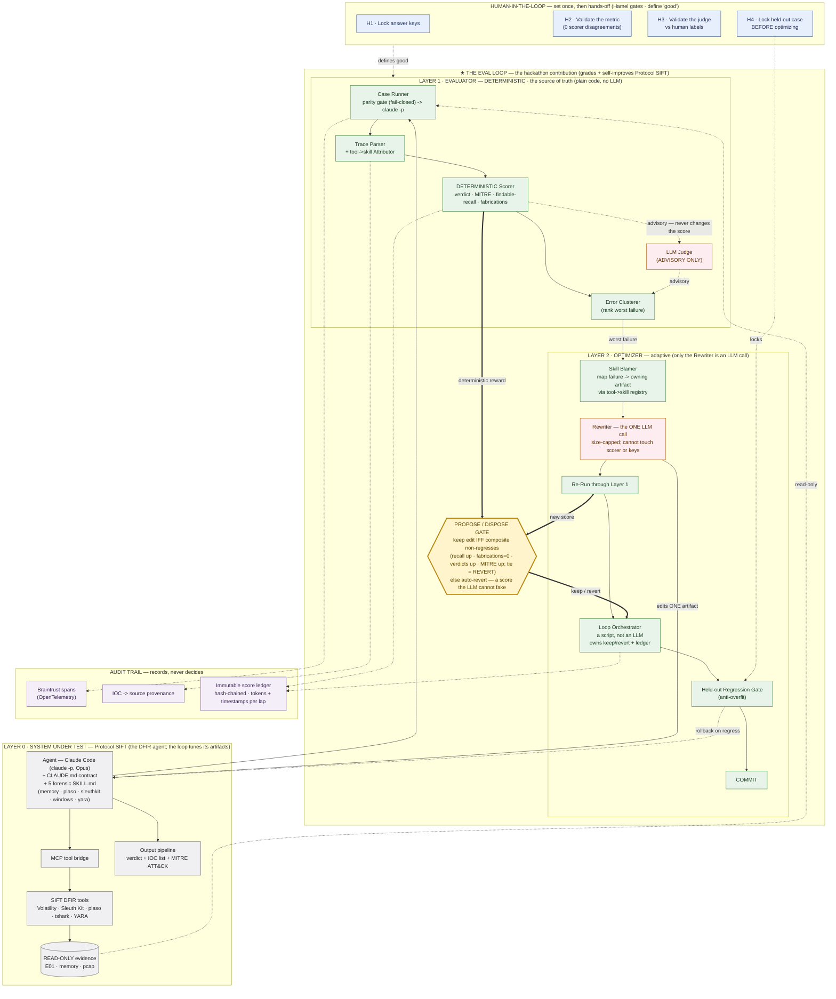

# Protocol SIFT — an Eval-Driven Optimization Loop for a DFIR Agent

> **An eval loop that grades a digital-forensics agent against answer-keyed cases and improves the agent's own context artifacts from a score it cannot fake.**

[](https://www.sans.org/)
[](LICENSE)

**SANS "Find Evil!" Hackathon submission.** Licensed under the [MIT License](LICENSE).

---

## What it is

The deliverable is an **eval-driven optimization loop**, not a forensic agent. Following Hamel Husain's eval methodology (*evaluate → debug → change*; "look at your data"; keep the AI judge OFF until validated), the loop grades a DFIR agent against cases with known answer keys and then improves the agent's **context artifacts** — its `CLAUDE.md` contract and five forensic `SKILL.md` files — from the graded signal, with **no model retraining**.

The agent it grades is **Protocol SIFT** = Claude (`claude -p`, Opus) plus the [`protocol-sift/`](protocol-sift/) config layer, running on a SANS SIFT Workstation. Protocol SIFT is the **System Under Test (SUT)** — the proof the loop works, not the contribution itself. The headline rule throughout: **the optimizer proposes; the deterministic evaluator disposes.** An edit survives only if a metric the LLM cannot influence says the agent got better, with no regression — otherwise it auto-reverts and every lap is written to a tamper-evident ledger.

---

## How it meets the brief

The three required hackathon capabilities all map to concrete machinery in this repo:

| Required capability | How it is realized | Where it lives |
| --- | --- | --- |
| **Self-correction** | The loop diagnoses a failure's root cause, changes *one* artifact, and keeps it only if the composite score rises with no regression — else auto-revert. In practice it caught a wrong gold answer key and a contaminated control, and the agent cleared innocent names / capped attribution where evidence was thin. | [`eval/diagnosis/`](eval/diagnosis/), [`scoring/keep_or_revert.py`](scoring/keep_or_revert.py), [`scoring/run_loop.py`](scoring/run_loop.py), [`scoring/score_ledger.py`](scoring/score_ledger.py) |
| **Accuracy validation** | An **un-gameable** metric: *findable-recall* credits an IOC only if its value appears in the evidence the agent actually saw, paired with a *fabrication counter* — structurally incapable of rewarding a hallucination. Every finding is traceable back to the tool that produced it. | [`scoring/scorer.py`](scoring/scorer.py) (52 tests), [`eval/score.py`](eval/score.py), [`trace_enrich/provenance.py`](trace_enrich/provenance.py) |
| **Analytical reasoning** | The agent emits a structured investigative narrative (verdict + IOC list + MITRE ATT&CK), not raw logs; deterministic assertion scorers grade architecture/integrity and skill-directive adherence. | [`protocol-sift/global/CLAUDE.md`](protocol-sift/global/CLAUDE.md), [`scorers/`](scorers/) (a1–a8, s1–s8) |

---

## Architecture

The system is two layers plus a propose/dispose gate: **Layer 0** is Protocol SIFT (the SUT); the **eval loop** (Layers 1+2 + the gate) is the contribution. Almost the entire loop is deterministic code — the *only* LLM in the trust path is the size-capped Rewriter, and the Judge stays strictly advisory.



**The one idea to take away:** the trust path is deterministic code (green). The only LLM in it is the **Rewriter** (one size-capped edit to one artifact), and the **Judge** is strictly advisory — it never moves the score. An edit survives only if a number the LLM cannot influence says it improved; otherwise it auto-reverts. That boundary is how the system stays autonomous without learning to fake its own success.

The full architecture write-up — component details, a one-lap data-flow walk-through, and the security boundaries — is in [`ARCHITECTURE.md`](ARCHITECTURE.md).

---

## Repository layout

| Path | Role |
| --- | --- |
| [`protocol-sift/`](protocol-sift/) | **The System Under Test (SUT):** the DFIR agent config layer — `global/CLAUDE.md` contract, the 5 forensic `skills/*/SKILL.md`, and the deliverable contract (`contract/`). |
| [`eval/`](eval/) | **The blind eval harness** (core deliverable): `run_blind.py` (bare-vs-SIFT arms in a sealed sandbox), `score.py` (incl. `--judge` gate), `parity_check.py` (fail-closed parity gate), schemas. |
| [`eval/diagnosis/`](eval/diagnosis/) | **The 6 rule-change "diagnosis protocol" tools:** failure aggregation + Wilson CI + z-test, judge validation (TPR/TNR), single-artifact ablation, monotonic regression gate, build-time key validator, contract↔scorer drift block. |
| [`contract-build/`](contract-build/) | Renders the deliverable contract + per-clause scorers (`scorer.py`, `presence_scorer.py`). |
| [`scoring/`](scoring/) | **The optimization-loop machinery:** deterministic IOC/verdict/MITRE scorer (52 tests), composite gate, keep-or-revert decider, hash-chained score ledger, single-lap orchestrator, frozen MITRE ATT&CK id catalog generator. |
| [`scorers/`](scorers/) | Deterministic assertion scorers `a1`–`a8` (architecture/integrity) + `s1`–`s8` (skill-directive adherence). |
| [`harness/`](harness/) | `run_case.py` (drives `claude -p --output-format stream-json`) + `parse_stream.py`. |
| [`trace_enrich/`](trace_enrich/) | Post-run Braintrust OpenTelemetry skill→tool attribution + provenance. |
| [`dataset/`](dataset/) | `cases.jsonl`, evidence inventory, manifest, hashes, answer-key denylist, case validator. |
| [`playbooks/`](playbooks/) | 24-topic DFIR playbook library + generator factory + gold playbooks. |
| [`scripts/`](scripts/) | Red-team-hardened secret/answer-key `leak_scan.py` + its tests + red-team battery. |
| [`docs/`](docs/) | `ACCESS.md`, `DATASET.md`, `ASSERTION_CATALOG.md`, `PLAN.md`. |

---

## Setup & how to run

### Prerequisites

- A **SANS SIFT Workstation** (the agent runs against forensic tooling there).
- **Claude Code** (`claude -p`, Opus) — the agent runtime.
- **Python 3** — the scorers, gates, and loop machinery are standard-library only.
- **Braintrust SDK** — *optional*, only needed for OpenTelemetry trace capture/enrichment.

### Configure secrets

Copy the example env file and fill in your own key. **Never commit a real key** — the leak-scan gate is there to stop exactly that.

```bash
cp .env.example .env
# then edit .env and set:
#   BRAINTRUST_API_KEY=<your-key-here>   # optional; only for trace capture
#   (the trace_enrich/ helper reads the same key from $BT_API_KEY — see docs/EXECUTION-LOGS.md)
```

### Core make targets

```bash
make sync           # rsync the repo to the SIFT Workstation VM
make eval           # run the Braintrust eval on the VM
make test           # run all unittest suites (scoring/, trace_enrich/, scorers)
make validate       # validate the dataset cases
make leak-scan      # secret/answer-key leak gate over the staged changeset (run before EVERY commit)
make leak-scan-test # the scanner's own unit tests + red-team battery
make verify-ledger  # verify the score-ledger hash chain
make pre-submit     # leak-scan + verify-ledger (run before any public push)
```

### How a judge runs a case

The SUT is **Protocol SIFT** = Claude (`claude -p`, Opus) + the [`protocol-sift/`](protocol-sift/) config layer on a SIFT Workstation. To run and grade a case:

1. `make sync` to push the repo to the SIFT VM, then `make validate` to confirm the dataset cases are well-formed.
2. Run a case through the harness — [`harness/run_case.py`](harness/run_case.py) drives `claude -p --output-format stream-json`; or run the A/B arms with [`eval/run_blind.py`](eval/run_blind.py) (bare Claude vs. Protocol SIFT in the sealed, network-blocked sandbox).
3. Score the run with [`eval/score.py`](eval/score.py) (deterministic; the `--judge` gate is opt-in and only used once validated) and/or [`scoring/scorer.py`](scoring/scorer.py).
4. Inspect the audit trail: traces flow to Braintrust via [`trace_enrich/`](trace_enrich/); every IOC is mapped back to the tool command that produced it.

### Diagnosis-protocol harness (operator layer)

These targets drive the rule-change / curation protocol in [`eval/diagnosis/`](eval/diagnosis/):

```bash
make aggregate                      # per-arm failure rate + Wilson CI + 2-proportion z
make judge-validate                 # TPR/TNR confusion matrix gating score.py --judge
make ablate                         # single-artifact ablation lap
make regression                     # monotonic guard-case non-regression gate
make validate-keys                  # build-time answer-key supportability gate
make check-contract-scorer-drift    # contract<->scorer drift HARD-block
make diagnosis-test                 # the diagnosis harness's own test suite
```

> Architectural guardrails are enforced by the system, not by the prompt: evidence is mounted **read-only**, the sandbox blocks **outbound network**, there is a **command allow-list**, and the leak-scan gate runs on commits. Per project policy, work is built and verified on the SIFT VM before it reaches the public repo.

---

## Evidence dataset

What the agent was tested against — sources, evidence inventory, and what was found — is documented in [`docs/DATASET.md`](docs/DATASET.md), with the machine-readable case set, manifest, hashes, and validator in [`dataset/`](dataset/). Answer-key *values* are deliberately **not** published; an [`answer_key_denylist`](dataset/answer_key_denylist.txt) plus the leak-scan gate keep gold IOCs out of this public repo.

---

## Accuracy & honesty

Honesty is valued over perfection, so the self-assessment (false positives, missed artifacts, hallucinated claims) is reported in **`ACCURACY.md`**.

**Headline result (one full closed lap on the live system):** a single data-driven contract edit moved **verdict accuracy 0-for-3 → 3-for-3** with **100% findable recall and 0 fabrications held**, and no regression. The loop was also rigorous enough to catch a **wrong gold answer key** and a **contaminated control**, and the agent stayed conservative where evidence was thin (it cleared innocent names and capped person-attribution on an open, passwordless network rather than naming a culprit).

**Honest scope:** this is **n = 3 cases**. The bare-vs-SIFT A/B runs are **captured but not yet fully scored** (numbers pending), and a human remains in the curation/keep-or-revert step by design. We report this scope plainly rather than overclaim.

---

## Execution logs / audit trail

The structured audit trail — tool-execution sequence with timestamps and token usage, iteration-over-iteration traces, and every finding traceable to the tool execution that produced it — is documented in **`docs/EXECUTION-LOGS.md`**. The capture/attribution machinery lives in [`trace_enrich/`](trace_enrich/) (Braintrust OpenTelemetry spans, skill→tool attribution, IOC→source provenance), and the per-lap tamper-evident record is the hash-chained ledger in [`scoring/score_ledger.py`](scoring/score_ledger.py) (verify with `make verify-ledger`).

---

## Demo video

**Demo video:** _TODO — link pending_

---

## Built on

- **SANS SIFT Workstation** — the forensic tooling environment the agent runs in.
- **Claude Code** (`claude -p`, **Opus**) — the agent runtime under test.

Both the SIFT Workstation and Claude Code are pre-existing substrate. The **novel contribution built during the hackathon is the eval-driven optimization loop** — the deterministic scorers, parity gate, trace→skill attributor, blamer, propose/dispose gate, keep/revert composite, orchestrator, held-out regression gate, and hash-chained ledger — together with the tuned `CLAUDE.md` contract and five `SKILL.md` artifacts the loop produced.

---

## License

Released under the **MIT License**. See [LICENSE](LICENSE).
