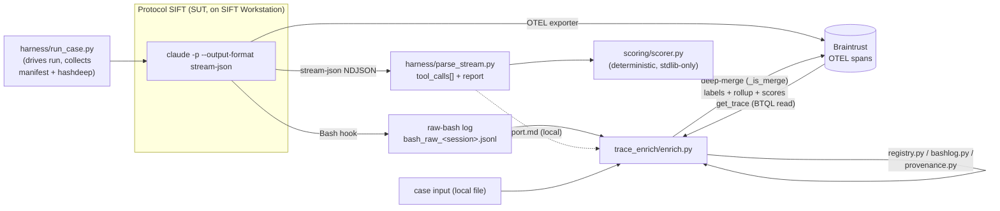
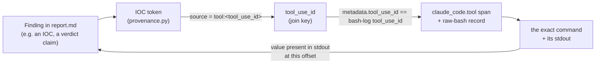

# Agent Execution Logs & Audit Trail

This document describes the **audit trail** for Protocol SIFT — the structured,
end-to-end record of what the agent did, in what order, with what tools, at what
cost — and the chain that lets a judge trace **any** finding in a report back to
the **exact tool execution** that produced it.

The system under test (SUT) is **Protocol SIFT = Claude (`claude -p`, Opus) + the
`protocol-sift/` config layer**, run on a SANS SIFT Workstation. Every run is
captured as structured telemetry, post-processed for skill→tool attribution, and
scored deterministically. None of the audit machinery alters how the agent runs —
it is observe-only.

> **Honesty note (scope).** The captured runs documented here are the three
> blind real-evidence cases (`n=3`). Some audit fields (e.g. run↔trace
> correlation) are still **manual today** — every such gap is marked inline.
> See `docs/` accuracy material for the full self-assessment.

---

## 1. What gets logged

For each run the agent produces a layered audit record. The layers, and the code
that produces them, are:

| Layer | What it contains | Produced / parsed by |
|-------|------------------|----------------------|
| **Stream events** | The raw `stream-json` NDJSON from `claude -p`: every `tool_use` block, its inputs, its `tool_result`, and the final assistant text (the report). | `harness/run_case.py` (drives the run) → `harness/parse_stream.py` (extracts `tool_calls[]` + report) |
| **Raw-bash log** | One JSON line per Bash invocation: ISO-8601 timestamp, `session_id`, `tool_use_id`, `cwd`, the **full** shell pipeline, the agent's own description, stdout/stderr (optionally a persisted-output pointer). Written by a forensic-audit hook on the VM. | consumed by `trace_enrich/bashlog.py` |
| **OTEL spans** | Claude Code's own OpenTelemetry export: `claude_code.interaction` (root), `claude_code.tool`, `claude_code.tool.execution` spans — timing, tool name, success boolean. | exported to **Braintrust**; read by `trace_enrich/bt_client.py` |
| **Enrichment labels** | Skill / phase / outcome per tool span, plus a root-span rollup (per-skill tool counts, success rate, IOC→tool provenance, scores). | `trace_enrich/enrich.py` (writes back via deep-merge) |
| **Run result object** | The `claude -p --output-format json` summary: `session_id`, turns, duration, cost (USD), token usage breakdown, final summary. | emitted by the run; mirrored in the trace manifest |
| **Integrity manifest** | Post-run evidence file listing + a `hashdeep` check against a frozen hash set, so the audit can prove evidence was not modified during the run. | `harness/run_case.py` (`manifest`, `hashes_ok`) |

**Timestamps + token usage** are both first-class:
- timestamps come from the OTEL spans (per-tool) and the raw-bash log (`ts`,
  ISO-8601 Z, per Bash call);
- token usage + cost come from the run-result object's `usage` /
  `total_cost_usd` (input / output / cache-creation / cache-read tokens are all
  recorded per model).

---

## 2. Capture pipeline (code pointers)



Key files:
- **`harness/run_case.py`** — drives `claude -p --output-format stream-json` for a
  single case, then collects the post-run forensic audit log, an evidence
  manifest, and a `hashdeep` integrity result (`hashes_ok`).
- **`harness/parse_stream.py`** — stateless parser of the `stream-json` NDJSON;
  pulls out every `tool_use` block (`id`, `name`, input, output) and reconstructs
  the final report text.
- **`trace_enrich/`** — post-run Braintrust enrichment (skill→tool attribution).
  - `bt_client.py` — reads the trace (BTQL), writes labels/scores back
    (deep-merge, `_is_merge`); applies the "two-roots rule" (keep the multi-span
    investigation root, drop the stray 1-span telemetry root).
  - `bashlog.py` — loads the raw-bash log; classifies whole-pipeline outcome
    (`ok` / `errored` / `empty`). Join key to the span is `tool_use_id`.
  - `registry.py` — deterministic tool→skill and tool→phase map, sourced from the
    five `SKILL.md` Tool tables + `global/CLAUDE.md`.
  - `provenance.py` — IOC→source tracing (see §4); reuses `scoring/scorer.py`'s
    extractors so provenance and the scorer agree token-for-token.
  - `enrich.py` — orchestrator + CLI; builds the plan (pure, unit-testable),
    applies it to Braintrust.

> **Architectural note.** The deciding metric is produced by `scoring/scorer.py`,
> which is **stdlib-only and reads local files** — it never touches Braintrust.
> Braintrust is an **observability / audit sidecar**, not on the keep-or-revert
> critical path. If Braintrust is down, the audit/scoreboard degrades but the
> grading and keep-or-revert math are unaffected.

---

## 3. Braintrust trace manifest

The three blind real-evidence runs were each launched headless (`claude -p`,
one case per root trace), with the case label embedded in the prompt and **no
answer key consulted** during the run.

| Case | Trace name | Braintrust root-span id | Status |
|------|------------|-------------------------|--------|
| case1 | `VIGIA-REAL-001` | `4553d295272c37b822a3c12cb60b487a` | completed |
| case2 | `VIGIA-REAL-002` | `c8c93ac98cba229f67f7f2c04a0a6553` | completed |
| case7 | `VIGIA-REAL-007` | `8f3266b5e66b4a31ad0c7e85f33e1dad` | completed |

Trace URLs (Braintrust project `protocol-sift`):

```
https://www.braintrust.dev/app/protocol-sift/p/protocol-sift/logs?r=4553d295272c37b822a3c12cb60b487a
https://www.braintrust.dev/app/protocol-sift/p/protocol-sift/logs?r=c8c93ac98cba229f67f7f2c04a0a6553
https://www.braintrust.dev/app/protocol-sift/p/protocol-sift/logs?r=8f3266b5e66b4a31ad0c7e85f33e1dad
```

**Run metadata (the `session_id` ↔ trace join key):**

| Case | Claude `session_id` | Turns | Duration | Cost (USD) |
|------|---------------------|-------|----------|------------|
| VIGIA-REAL-001 | `d50b6132-4b67-4655-bda0-92c8a033f841` | 5 | ~161s | 0.72 |
| VIGIA-REAL-002 | `60ec2a52-b517-450d-b953-f67290518a1f` | 7 | ~194s | 0.96 |
| VIGIA-REAL-007 | `b2bb212f-d701-4bfc-bc9f-7f3556957d19` | 8 | ~199s | 0.96 |

**Token usage (from the run-result objects):**

| Case | Input | Output | Cache-create | Cache-read |
|------|-------|--------|--------------|------------|
| VIGIA-REAL-001 | 3,088 | 12,083 | 31,898 | 161,410 |
| VIGIA-REAL-002 | 3,724 | 15,522 | 41,860 | 266,658 |
| VIGIA-REAL-007 | 3,223 | 14,288 | 42,989 | 313,169 |

Notes / known limitations:
- Each run also emitted a stray **1-span** telemetry root span
  (`f83d3112…`, `e6bf010d…`, `60af9775…`). Grade the **multi-span** root listed
  above; ignore the singletons (the enricher's two-roots rule does this
  automatically).
- **Auth limitation.** The Braintrust URLs are in a private project. A judge may
  need **read access** to open them. The substantive audit data (spans, labels,
  rollup, scores) is reproducible **locally** from the raw-bash log + report +
  `trace_enrich/` without Braintrust access — the trace is a convenience mirror,
  not the source of truth.
- **Manual correlation gap (today).** `run_case.py` / `eval/run_blind.py` do not
  yet capture the `session_id` automatically, so the run↔trace correlation for
  these three cases is done by hand (the ids above, baked into the enricher's
  known-cases shorthand). Automating capture is on the roadmap.
- **Secrets.** No API key, bearer token, or `.env` value appears in this
  document or any committed file. The Braintrust key is read from `$BT_API_KEY`
  at runtime only; see `.env.example` for the placeholder.

---

## 4. Tracing any finding back to the tool that produced it

The core audit guarantee: **every finding is traceable to the specific tool
execution that produced it.** The chain has four hops, joined by stable ids.



Step by step:

1. **Finding → IOC token.** `trace_enrich/provenance.py` extracts the
   IOC-shaped tokens a report asserts, using the **same** extractors/normalisers
   as `scoring/scorer.py` (so provenance and the scorer agree exactly).
2. **IOC → source.** For each token, provenance searches two haystacks in order:
   every tool's stdout (from the raw-bash log) and the case input the agent
   `Read`. The result records `source = "tool:<tool_use_id>"` (first tool in log
   order whose stdout contained the value), or `"case_input"`, or `None`.
3. **`tool_use_id` → span + command.** `tool_use_id` is the join key:
   `metadata.tool_use_id` on the Braintrust `claude_code.tool` span equals the
   `tool_use_id` in the raw-bash record. That record carries the **full shell
   pipeline** (the exact command) and its stdout (or a persisted-output pointer).
4. **Command → evidence.** The command (e.g. an `icat` / `fls` extraction over
   read-only-mounted evidence) is the offset into the evidence; the value
   appearing in that command's stdout closes the loop back to the finding.

This chain is also a **hallucination tripwire**: if `source is None` — the value
appears in **neither** any tool stdout **nor** the case input — provenance flags
it as a `candidate_fabrication`. This mirrors the scorer's fabrication penalty
(only the clean, extractable kinds — email, hash, MAC, IPv4, SID — are eligible;
CIDR base addresses are masked out so they are never mis-flagged). The metric is
therefore **structurally incapable of rewarding a value that has no evidentiary
source**.

### Where the labels land in the trace

- **Per tool span** (`metadata.enrich` + tags): the owning **skill**, the
  forensic **phase** (`discovery` / `extract` / `analyze` / `report`), and the
  whole-pipeline **outcome** (`ok` / `errored` / `empty`). A skipped extraction
  or an empty-stdout tool is therefore visible at a glance.
- **On the root span** (`metadata.rollup` + `scores`): per-skill tools-run /
  success-rate / IOCs-surfaced, the **IOC→tool provenance** list +
  candidate-fabrication count, `skill_expected` vs `skill_used`, and the run
  scores (`findable_recall`, `fabrications`, `verdict`, `mitre`) — scores only
  when ground truth is supplied, and re-computed there **only to mirror** the
  local scorer's numbers onto the trace for human inspection.

---

## 5. Reproducing / inspecting a run's audit trail

Read the enriched run in Braintrust (root-span id from §3):

```
https://www.braintrust.dev/app/protocol-sift/p/protocol-sift/logs?r=<root_span_id>
```

Per-tool labels appear on each `claude_code.tool` span's metadata/tags; the
rollup + scores appear on the root `claude_code.interaction` span.

Re-run the enrichment locally (dry run — prints exactly what would be merged,
reads only):

```bash
python3 -m trace_enrich.enrich --case case7 \
  --bash-log <path>/bash_raw_<session>.jsonl \
  --case-input <path>/case7.json \
  --report <path>/VIGIA-REAL-007_investigation_report.md \
  --plan
```

`--case case1|case2|case7` is shorthand for the three known runs; `--session`
accepts either the 32-hex OTEL trace id or the Claude session UUID. Without
`--ground-truth` the run still enriches (tags / phases / outcomes / rollup /
provenance) and records that scores were omitted; adding `--ground-truth` emits
the mirrored scores, and `--verify` re-reads the root span after the write.

> **Iteration-over-iteration traces.** The eval loop runs cases through the
> capture pipeline lap after lap; the per-lap deltas (and the keep-or-revert
> decision) are recorded by the optimization machinery in `scoring/`
> (`run_loop.py`, `keep_or_revert.py`) and committed to a hash-chained,
> tamper-evident ledger (`scoring/score_ledger.py`, verifiable with
> `make verify-ledger`). The Braintrust traces are the per-run evidence those
> laps were measured from.

---

## 6. Summary of guarantees and honest caveats

**Guarantees**
- Every tool call is logged with a timestamp (OTEL span + raw-bash `ts`).
- Token usage and cost are recorded per run (and per model).
- Every IOC-shaped finding is traceable to its source tool execution via
  `tool_use_id`, or flagged as a candidate fabrication if it has none.
- Evidence integrity is checked post-run (`hashdeep`) and recorded as `hashes_ok`.
- The deciding scorer is deterministic, stdlib-only, and local — independent of
  the audit sidecar.

**Caveats (verified-honest)**
- `n=3` captured real-evidence runs.
- Run↔trace correlation is currently **manual** (session ids baked into the
  enricher's known-cases shorthand); auto-capture is pending.
- The raw-bash log is **Bash-only** — `Read` / `Write` / MCP tool calls are not
  in it (they are in the OTEL spans / stream-json, not the bash log).
- Pipeline `outcome` is computed at the **whole-bash-call** level (one pipeline =
  one outcome); there are no per-sub-tool exit codes in the span schema.
- Braintrust URLs may require **read access** for a judge; the audit data is
  reproducible locally without it.
